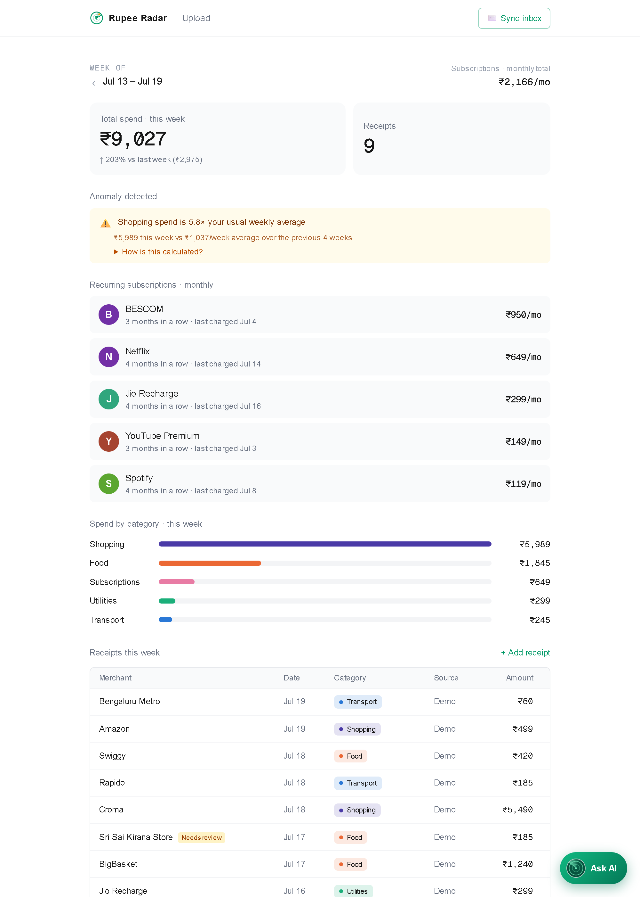
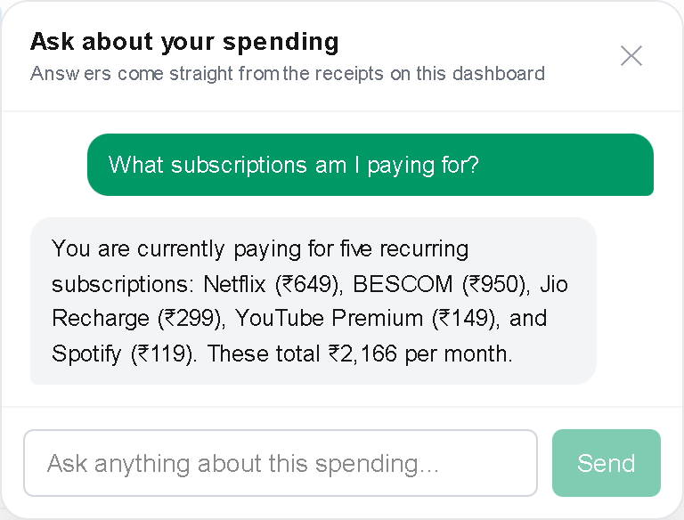

# 📡 Rupee Radar

> **Catches every receipt, flags every subscription.**

Rupee Radar is a personal AI agent that turns scattered receipts — photos,
GPay screenshots, and emails — into a clean weekly spending dashboard. Gemini
reads every receipt into structured data, categorizes it, watches for
recurring subscriptions and spending anomalies, and answers plain-language
questions about where your money went.

**🔗 Live demo: [expense-receipt-agent.vercel.app](https://expense-receipt-agent.vercel.app)**

> 🏆 Built solo for the **AI Agent Builder Series 2026 — Grand Finale
> Hackathon** (AI House × Google for Developers, Bengaluru)

<picture>
  <source media="(prefers-color-scheme: dark)" srcset="docs/screenshots/dashboard-dark.png">
  
</picture>

## Try it in 30 seconds

No login needed:

1. **Open the [dashboard](https://expense-receipt-agent.vercel.app)** — flip
   through weeks, click a category bar to filter receipts.
2. **Tap the 💬 bubble** and ask *"How much did I spend on food this week?"*
   or *"What subscriptions am I paying for?"* — answers come straight from
   the receipts on screen.
3. **[Upload](https://expense-receipt-agent.vercel.app/upload) any receipt or
   GPay screenshot** — watch Gemini extract and categorize it live. Try-it
   mode: your image is processed but never stored.

<p align="center">
  <picture>
    <source media="(prefers-color-scheme: dark)" srcset="docs/screenshots/chat-dark.png">
    
  </picture>
</p>

## What it does

1. **Drop in a receipt** — upload a photo/screenshot (Google Pay transaction
   screenshots work great), or forward a receipt email.
2. **Gemini reads it** — merchant, date, total, and line items are extracted
   as structured data and auto-categorized (Food, Transport, Subscriptions,
   Shopping, Utilities, Other). Foreign-currency receipts are converted to
   INR with the original amount preserved.
3. **Dashboard updates** — weekly spend total with week-over-week delta,
   color-coded spend-by-category bars, and the week's receipts, live from
   Firestore. Flip between past weeks with the week navigator, and click a
   category bar to filter the receipt list.
4. **Subscriptions get flagged** — same merchant + similar amount recurring
   ~monthly triggers a flag like *"Netflix — ₹649/mo, 3 months in a row"*,
   plus a combined "₹1,067/mo in subscriptions" callout.
5. **Ask it anything about your spending** — the 💬 chat agent answers
   questions grounded in the actual receipt data (*"What was my biggest
   expense this month?"*), refuses off-topic requests, and never invents
   numbers.
6. **It reasons about your spending — and shows its work** — anomaly detection
   compares each category against your 4-week average (*"Food spend is 40%
   above your usual weekly average"*) with the baseline and formula one click
   away; every extraction carries a confidence self-assessment ("Needs review"
   badge when unsure); and each receipt keeps its provenance with a link back
   to the original image.

## How it works

```
photo / GPay screenshot ─┐
                         ├─→ Gemini (multimodal, structured JSON) ─→ zod ─→ Firestore
Gmail "receipts" label ──┘                                                    │
                                                                              ▼
                 💬 chat agent  ←─ receipts inlined into prompt ←─  server-rendered dashboard
                                                                   (weekly stats · subscriptions · anomalies)
```

- **One extraction pipeline, three intakes** — uploads, email bodies, and
  email attachments all flow through the same Gemini → zod → Firestore path.
- **Owner mode** — a single passcode gates writing (Gmail sync, saving
  uploads, deleting receipts); visitors get the read-only dashboard, try-it
  extraction, and the chat agent.
- **Grounded chat** — every question ships the full receipt list to Gemini
  with strict "answer only from this data" rules. No RAG, no history: simple
  and auditable.
- **Rule-based detection where rules beat models** — subscriptions
  (±10% amount, 25–35 day cadence, 3+ months) and anomalies (≥1.3× the
  4-week average) are deterministic code, so the flags are explainable.

## Tech stack

| Layer | Choice |
|---|---|
| Extraction, categorization & chat | Gemini (multimodal, structured output) via `@google/genai` |
| Storage | Firebase Firestore (`firebase-admin`, server-side) |
| App | Next.js 16 (App Router) + TypeScript + Tailwind |
| Email intake | Gmail API (dependency-free OAuth + REST) |
| Hosting | Vercel |

## Setup

1. **Clone & install**

   ```bash
   git clone https://github.com/sital-tharu/Expense-Receipt-Agent.git
   cd Expense-Receipt-Agent
   npm install
   ```

2. **Firebase** — create a project at [console.firebase.google.com](https://console.firebase.google.com),
   enable **Cloud Firestore**, then *Project settings → Service accounts →
   Generate new private key*. Save the JSON as `secrets/serviceAccount.json`.

3. **Gemini API key** — create one at [aistudio.google.com/apikey](https://aistudio.google.com/apikey).

4. **Environment** — copy `.env.example` to `.env.local` and fill in:

   ```
   GEMINI_API_KEY=your-key
   FIREBASE_SERVICE_ACCOUNT_PATH=./secrets/serviceAccount.json
   ```

5. **Gmail intake (optional)** — lets the agent pull receipts straight from
   your inbox:
   1. In [console.cloud.google.com](https://console.cloud.google.com), select
      the same project as your Firebase app → *APIs & Services → Library* →
      enable **Gmail API**.
   2. *APIs & Services → OAuth consent screen* → External → fill the app name,
      add your own Gmail as a **test user**.
   3. *APIs & Services → Credentials → Create credentials → OAuth client ID* →
      type **Web application** → authorized redirect URI
      `http://localhost:3000/api/gmail/callback`. Copy the client ID and
      secret into `.env.local` (`GMAIL_CLIENT_ID`, `GMAIL_CLIENT_SECRET`).
   4. In Gmail, create a label named **receipts** and apply it to the emails
      you want imported (or add a filter that does it automatically).
   5. In the app, click **Connect Gmail** → approve read-only access → click
      **Sync inbox**. Already-imported emails are skipped on every re-sync.

6. **Run**

   ```bash
   npm run dev          # app at http://localhost:3000
   ```

## Deploying to Vercel (free)

1. Push the repo to GitHub, then in [vercel.com](https://vercel.com) → *Add New →
   Project* → import the repo (defaults are fine — Next.js is auto-detected).
2. Under *Environment Variables*, add:
   - `GEMINI_API_KEY`
   - `FIREBASE_SERVICE_ACCOUNT_JSON` — the **entire** `serviceAccount.json`
     pasted as one value (used instead of the file path)
   - `GMAIL_CLIENT_ID`, `GMAIL_CLIENT_SECRET`
   - `GMAIL_ROUTES_SECRET` — any passcode; on the public URL it becomes the
     **owner passcode**: required to connect/sync Gmail, save uploads to the
     dashboard, and delete receipts. Visitors still get the read-only
     dashboard, try-it uploads, and the chat agent.
   - `EXCHANGE_RATE_USD` (and any other rates you use)
   - Optionally `CHAT_DAILY_LIMIT` / `EXTRACT_DAILY_LIMIT` — daily caps on
     visitor AI usage (defaults 300 / 100; owner requests are exempt)
3. In the Google Cloud console → your OAuth client → add a second authorized
   redirect URI: `https://<your-app>.vercel.app/api/gmail/callback`.
4. Deploy. On the live site, click **Connect Gmail**, enter your passcode,
   approve — the token is stored in Firestore, so it survives deployments.

## Useful scripts

| Command | What it does |
|---|---|
| `npm run test:extract -- samples/<image>` | Extract a receipt image from the CLI and save it to Firestore (`--dry-run` to skip the write) |
| `npm run seed` | Seed a rich mock receipt history for the demo — subscription streaks, a scripted anomaly, currency + low-confidence showcases (`-- --wipe` clears previously seeded docs first; `-- --wipe-real` backs up real receipts to `secrets/` and removes them for a clean public demo) |
| `npm run test:logic` | Regression checks for subscription detection & weekly stats (no credentials needed) |

## Roadmap

- **Real user accounts** — per-user dashboards and uploads (the owner-mode
  seam in `src/lib/owner.ts` is built to be swapped for sessions).
- **Per-user Gmail sync** — pending Google's restricted-scope verification
  for public apps.
- PDF receipt support, weekly summary emails, spending trends over months.
